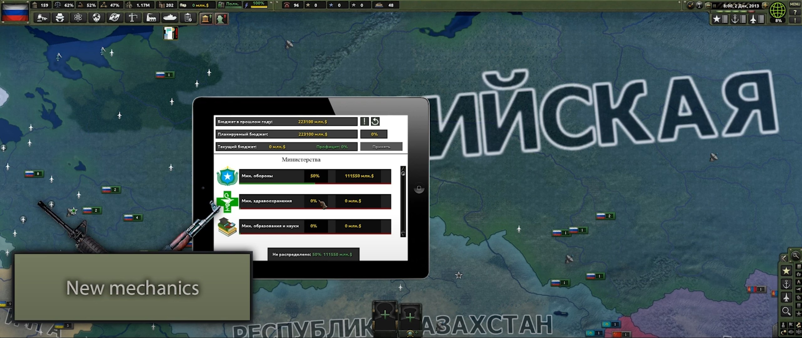
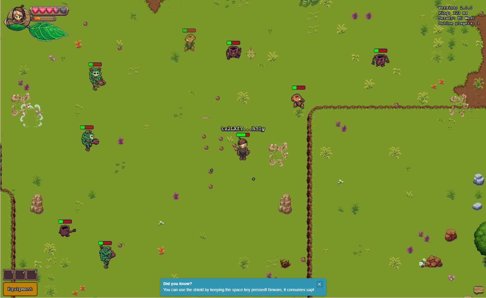
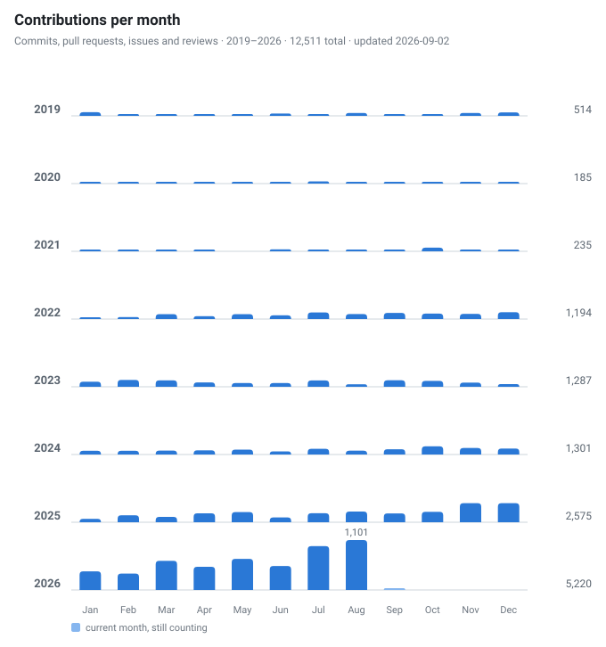
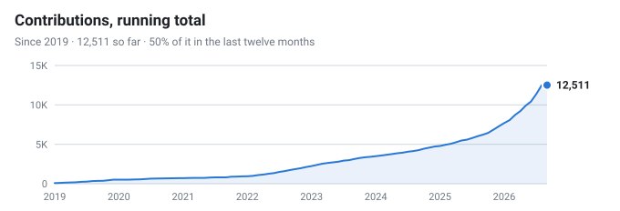
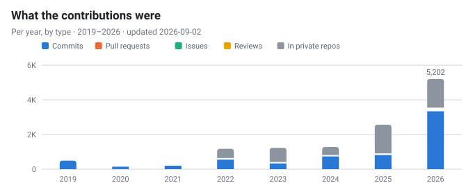

<!-- Animated Header Banner -->

<!-- Terminal-Style Introduction -->

<!-- Badge Row -->

---

## Primary Stack &nbsp;·&nbsp; AI Research

`vision-language models` &nbsp; `contrastive learning` &nbsp; `explainable AI` &nbsp; `medical imaging` &nbsp; `diffusion & inpainting`

 

### Secondary Stack &nbsp;·&nbsp; Software Engineering

<small>Nine years of production work. These days I mostly use it to ship research.</small>

 

---

## Research

I do computer vision research, mostly for medicine and biology. Abstracts and BibTeX are on
**[suxrobgm.net/research](https://suxrobgm.net/research)**, citations on
[Google Scholar](https://scholar.google.com/citations?user=p7ujRHoAAAAJ&hl=en).

### Publications

> ### MorphoCLIP
>
> 
> 
> 
>
> Matches microscope images of treated cells to a plain-language description of the drug or gene behind the change. The encoders stay frozen and only small heads train, so one consumer GPU is enough.
>
> <small>**CPJUMP1** · 51 plates · 3M+ images</small>
>
> 
> 

> ### Localize, Don't Beautify
>
> 
> 
>
> Commercial image editors asked to change one facial feature tend to retouch the whole face. I compared three ways to keep the edit local, and plain masking did better than prompt-only steering.
>
> <small>**6 editors** · 196 edits · identity scored</small>
>
> 
> 

> ### MelanomaNet
>
> 
> 
>
> Sorts skin lesions into all nine ISIC 2019 classes, then checks the model's GradCAM++ attention against the ABCDE criteria dermatologists already use and scores how well the two agree.
>
> <small>**ISIC 2019** · 25K images · 0.86 F1</small>
>
> 
> 

### Vision Projects

> ### [Med Image Scanner](https://github.com/suxrobgm/med-image-scanner)
>
> Pulls studies from a hospital's PACS over DICOM and runs detection models on them. Predictions appear as overlays in the viewer next to the usual measurement and segmentation tools, and the whole thing is built for HIPAA.
>
> 
> 
> 
> 

> ### [Bookshelf Scanner](https://github.com/suxrobgm/bookshelf-scanner)
>
> Snap a photo of a bookshelf and get back a list of the books. YOLO picks out each spine and a vision-language model reads the title and author.
>
> 
> 
> 
> 

> ### [LightDepth](https://github.com/suxrobgm/lightdepth)
>
> Depth from a single image in **14.3M parameters**, against 24.8M for Depth Anything V2. It runs **72% faster** and has slightly lower relative error on NYU Depth V2.
>
> 
> 

> ### [FSRCNN](https://github.com/suxrobgm/fsrcnn)
>
> My reimplementation of FSRCNN (Dong et al., ECCV 2016) for 2x/3x/4x super-resolution. Learning the upsampling end to end is what makes it **40x faster** than SRCNN, and it still gains +1.78 dB PSNR on Set5.
>
> 
> 

---

## Software Engineering

> ### [LogisticsX](https://logisticsx.app)
>
> 
>
> Multi-tenant system for running an intermodal trucking company. A multi-provider LLM agent handles dispatch, and the platform plugs into DAT and Truckstop, tracks ELD hours-of-service, plans routes, shows trucks live, and handles payouts through Stripe Connect. Built on DDD and CQRS.
>
> 
> 
> 
> 
> 

> ### [Meat.gg](https://meat.gg)
>
> `60K+ users` &nbsp; `1K+ DAU`
>
> Community site for Counter-Strike 2 servers, with profiles, messaging, and a Stripe shop. A native server plugin lets admins ban players, handle reports, and moderate without leaving the game.
>
> 
> 
> 
> 
> 

> ### [DepVault](https://depvault.com)
>
> 
>
> Checks a project's dependencies against OSV.dev for known vulnerabilities across **8+ ecosystems**. It's also an encrypted secrets vault (AES-256-GCM) with one-time sharing and a CLI that injects tokens into CI/CD.
>
> 
> 
> 
> 

> ### [Blazor Form Builder](https://github.com/suxrobgm/blazor-form-builder)
>
> Drag-and-drop form designer for Blazor. Forms are saved as JSON schema and rendered at runtime, so admin dashboards don't need hand-written forms.
>
> 
> 
> 

---

## Games

<table>
<tr>
<td width="50%" valign="top" align="center">

**Hearts of Iron IV: Economic Crisis**

Big overhaul mod I led, with its own mechanics, AI behavior, and balance changes.

[Steam Workshop](https://steamcommunity.com/sharedfiles/filedetails/?id=2000532465) · [Releases](https://github.com/Economic-Crisis/Public-releases)

</td>
<td width="50%" valign="top" align="center">

**Chestnut (MMO)**

Real-time MMO with an authoritative server and custom physics that keeps 100+ players in sync. Has Web3 integration.

[Play](https://www.chest-nut.io)

</td>
</tr>
<tr>
<td width="50%" valign="top" align="center">

**ChessMate**

Online chess with AI opponents and rated or friendly PvP matchmaking.

[Repo](https://github.com/suxrobGM/online-chess)

</td>
<td width="50%" valign="top" align="center">

**Maze**

2D puzzle game with AI pathfinding and level progression.

[Repo](https://github.com/suxrobGM/maze-godot)

</td>
</tr>
</table>

---

## GitHub Activity

<picture>
  <source media="(prefers-color-scheme: dark)" srcset="./assets/activity-dark.svg">
  
</picture>

<picture>
  <source media="(prefers-color-scheme: dark)" srcset="./assets/cumulative-dark.svg">
  
</picture>

<picture>
  <source media="(prefers-color-scheme: dark)" srcset="./assets/mix-dark.svg">
  
</picture>

<picture>
  <source media="(prefers-color-scheme: dark)" srcset="./assets/languages-dark.svg">
  
</picture>

<small>All four regenerate daily from the GitHub GraphQL API via <a href="./scripts/activity_chart.py">activity_chart.py</a>.</small>

  

---

### Get in Touch

I'm open to research collaborations and PhD-adjacent work. Also happy to talk computer vision, .NET, TypeScript, or game dev.

<!-- Footer Wave -->

