

<picture>
  <source media="(max-width: 600px)" srcset="./assets/terminal-intro-mobile.svg">
  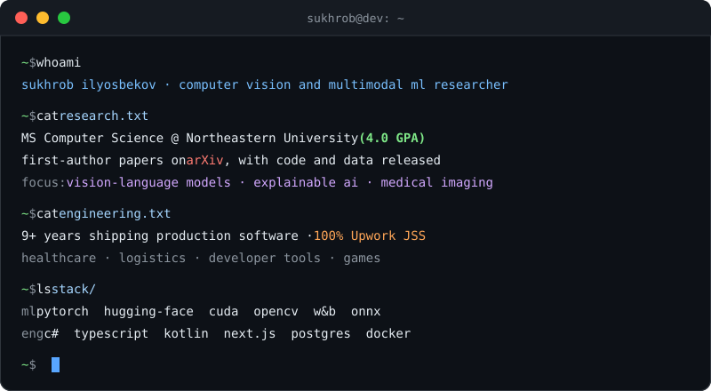
</picture>

 

## Research

I do computer vision research, mostly for medicine and biology. Abstracts and BibTeX are on
**[suxrobgm.net/research](https://suxrobgm.net/research)**.

> 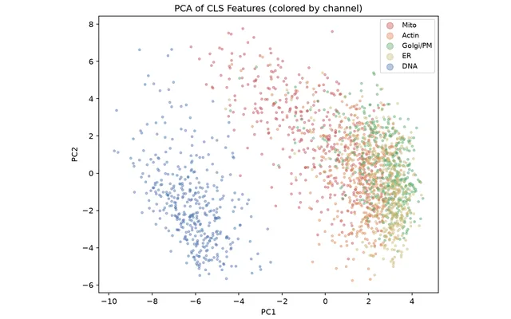
>
> ### [MorphoCLIP](https://arxiv.org/abs/2608.22690)
>
> 
> 
> 
>
> Matches microscope images of treated cells to a plain-language description of the drug or gene behind the change. The encoders stay frozen and only small heads train, so one consumer GPU is enough.
>
> <small>**CPJUMP1** · 51 plates · 3M+ images</small> 

> 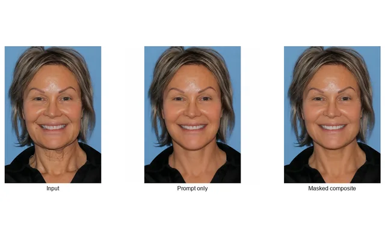
>
> ### [Localize, Don't Beautify](https://arxiv.org/abs/2608.02841)
>
> 
> 
>
> Commercial image editors asked to change one facial feature tend to retouch the whole face. I compared three ways to keep the edit local, and plain masking did better than prompt-only steering.
>
> <small>**6 editors** · 196 edits · identity scored</small> 

> 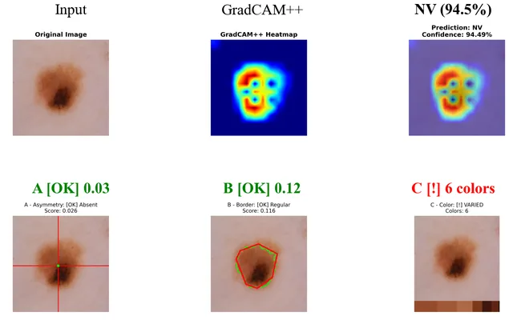
>
> ### [MelanomaNet](https://arxiv.org/abs/2512.09289)
>
> 
> 
>
> Sorts skin lesions into all nine ISIC 2019 classes, then checks the model's GradCAM++ attention against the ABCDE criteria dermatologists already use and scores how well the two agree.
>
> <small>**ISIC 2019** · 25K images</small> 

## Selected work

> 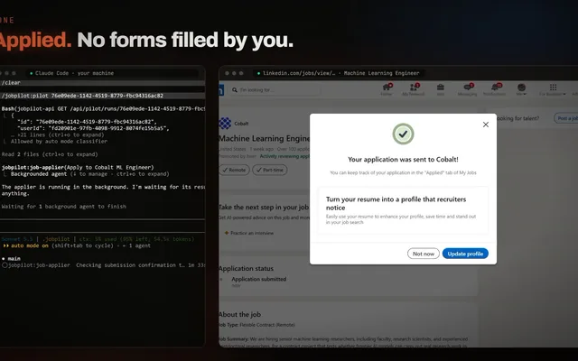
>
> ### [JobPilot](https://github.com/suxrobGM/jobpilot)
>
> An AI agent that applies to jobs for you. It finds openings, tailors your resume, and fills out applications in a real browser on your own machine, running on your Claude Code or Codex subscription.
>
> <small>TypeScript · Playwright · [jobpilot.suxrobgm.net](https://jobpilot.suxrobgm.net)</small> 

> 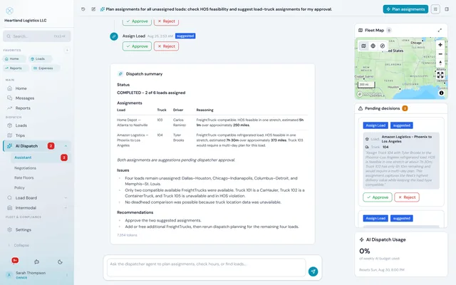
>
> ### [LogisticsX](https://logisticsx.app)
>
> Runs an intermodal trucking company end to end. An LLM agent handles dispatch, and the platform plugs into DAT and Truckstop, tracks hours of service, plans routes, shows trucks live, and pays drivers through Stripe Connect.
>
> <small>C# · Angular · Kotlin Multiplatform · PostgreSQL · [source](https://github.com/suxrobgm/logistics-app)</small> 

> 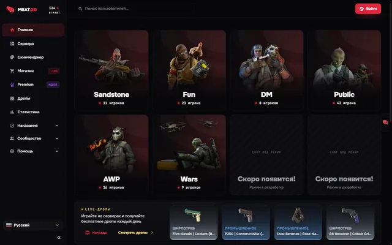
>
> ### [Meat.gg](https://meat.gg)
>
> Community site for Counter-Strike 2 servers with 60K+ users, with profiles, messaging and a Stripe shop. A native server plugin built on [voltmod](https://github.com/VoltyGames/voltmod) lets admins ban players and handle reports without leaving the game.
>
> <small>Next.js · Bun · C++23 · PostgreSQL</small> 

> 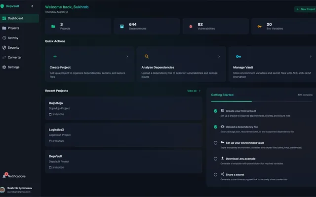
>
> ### [DepVault](https://depvault.com)
>
> Checks a project's dependencies against OSV.dev for known vulnerabilities across 8+ ecosystems. It's also an encrypted secrets vault with one-time sharing and a CLI that injects tokens into CI/CD.
>
> <small>Next.js · .NET AOT · PostgreSQL · [source](https://github.com/suxrobGM/depvault)</small> 

<b>More projects</b>

 

**Vision**

- **[Med Image Scanner](https://github.com/suxrobgm/med-image-scanner)** pulls studies from a hospital's PACS over DICOM, runs detection models on them, and overlays the predictions in the viewer. Built for HIPAA.
- **[Bookshelf Scanner](https://github.com/suxrobgm/bookshelf-scanner)** turns a photo of a bookshelf into a list of books. YOLO finds each spine and a vision-language model reads the title and author.
- **[LightDepth](https://github.com/suxrobgm/lightdepth)** estimates depth from a single image with about half the parameters of Depth Anything V2, runs 72% faster, and has slightly lower error on NYU Depth V2.
- **[FSRCNN](https://github.com/suxrobgm/fsrcnn)** is my reimplementation of FSRCNN (Dong et al., ECCV 2016) for 2x, 3x and 4x super-resolution.

**Engineering**

- **[Blazor Form Builder](https://github.com/suxrobgm/blazor-form-builder)** is a drag-and-drop form designer. Forms are saved as JSON schema and rendered at runtime.
- **[voltmod](https://github.com/VoltyGames/voltmod)** is a native C++23 framework for writing Counter-Strike 2 server plugins.

<b>Games</b>

 

<table>
<tr>
<td width="50%" valign="top">
<a href="https://steamcommunity.com/sharedfiles/filedetails/?id=2000532465">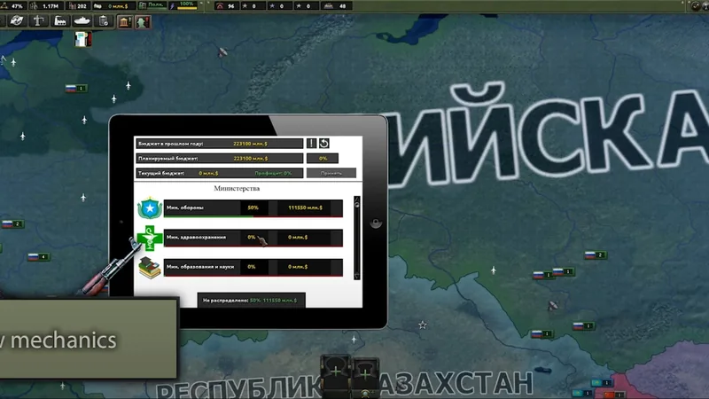</a>
 <b><a href="https://steamcommunity.com/sharedfiles/filedetails/?id=2000532465">Hearts of Iron IV: Economic Crisis</a></b>
 <small>Overhaul mod I led, with its own mechanics, AI behavior and balance.</small>
</td>
<td width="50%" valign="top">
<a href="https://www.chest-nut.io">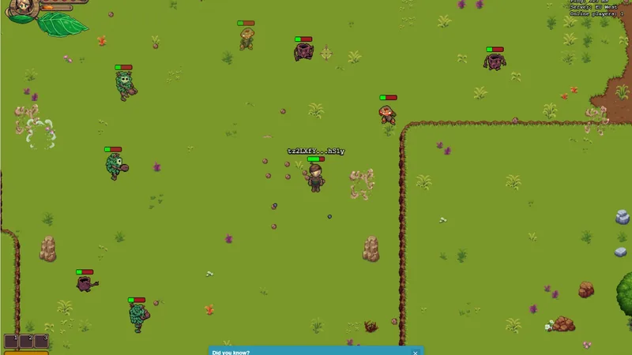</a>
 <b><a href="https://www.chest-nut.io">Chestnut</a></b>
 <small>Real-time MMO with an authoritative server that keeps 100+ players in sync.</small>
</td>
</tr>
<tr>
<td width="50%" valign="top">
<a href="https://github.com/suxrobGM/online-chess">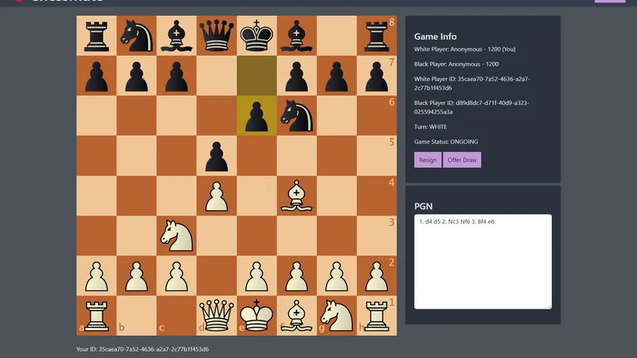</a>
 <b><a href="https://github.com/suxrobGM/online-chess">ChessMate</a></b>
 <small>Online chess with AI opponents and rated or friendly matchmaking.</small>
</td>
<td width="50%" valign="top">
<a href="https://github.com/suxrobGM/maze-godot">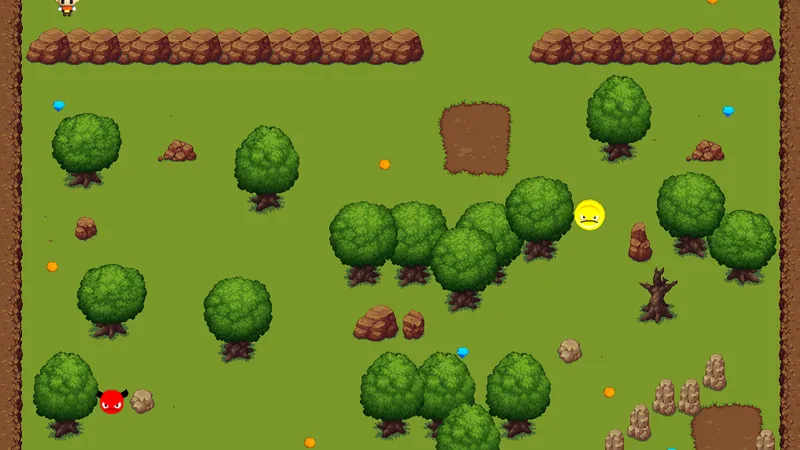</a>
 <b><a href="https://github.com/suxrobGM/maze-godot">Maze</a></b>
 <small>2D puzzle game in Godot with AI pathfinding.</small>
</td>
</tr>
</table>

## Activity

<picture>
  <source media="(prefers-color-scheme: dark)" srcset="./assets/timeline-dark.svg">
  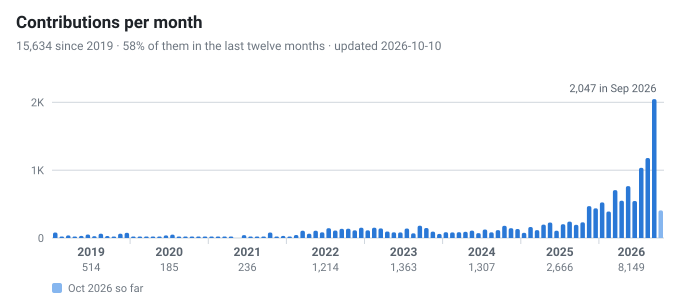
</picture>

<picture>
  <source media="(prefers-color-scheme: dark)" srcset="./assets/languages-dark.svg">
  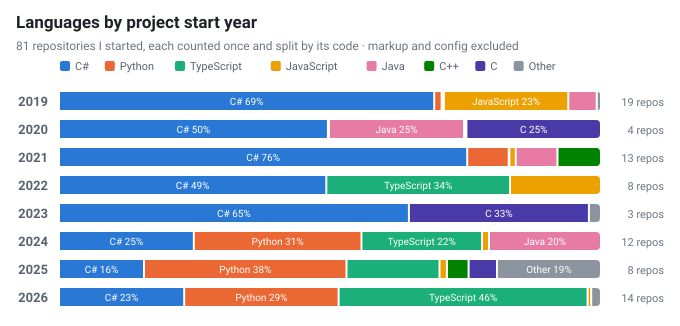
</picture>

<small>Redrawn daily from the GitHub API by <a href="./scripts/activity_chart.py">activity_chart.py</a>.</small>

---

Open to research collaborations and PhD-adjacent work, and happy to talk computer vision, .NET, TypeScript or game dev.

[Email](mailto:silyosbekov@gmail.com) · [Telegram](https://t.me/suxrobgm) · [LinkedIn](https://www.linkedin.com/in/suxrobgm) · [Buy me a coffee](https://buymeacoffee.com/suxrobgm)

