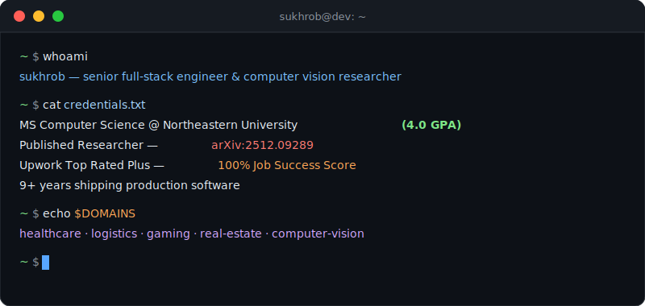
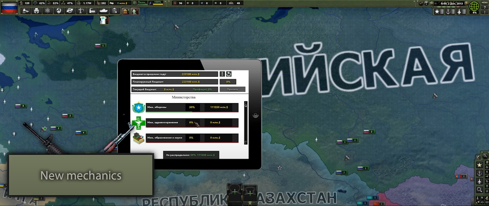
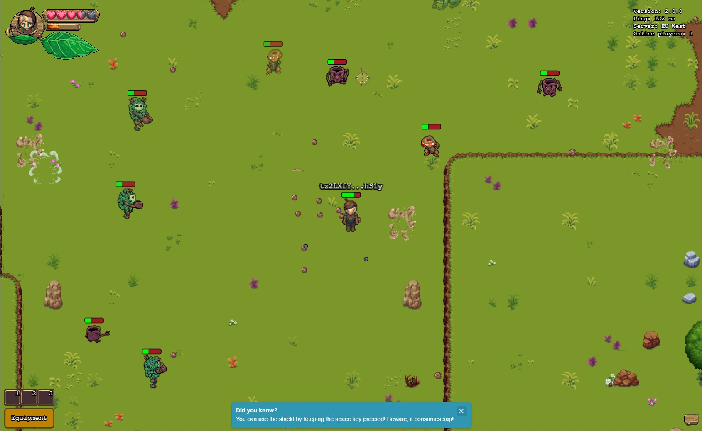

<!-- Animated Header Banner -->

<!-- Terminal-Style Introduction -->

<!-- Badge Row -->

---

<!-- Tech Stack Icons -->

### Tech Stack

 

 

 

 

 

---

<!-- Impact by Numbers -->

### Impact by Numbers

<table>
<tr>
<td align="center" width="25%">

 
<strong>30K+</strong>
 
Users on Meat.gg
</td>
<td align="center" width="25%">

 
<strong>10+</strong>
 
Shipped Projects
</td>
<td align="center" width="25%">

 
<strong>100%</strong>
 
Upwork Job Success
</td>
</tr>
</table>

---

### Research & Publications

<table>
<tr>
<td width="33%">

**[MelanomaNet](https://github.com/suxrobgm/explainable-melanoma)**

Explainable deep learning for skin lesion classification across **9 ISIC 2019 categories** with GradCAM++ visualization and automated ABCDE feature extraction.

</td>
<td width="33%">

**[LightDepth](https://github.com/suxrobgm/lightdepth)**

Lightweight monocular depth estimation — **42% fewer params** than Depth Anything V2, **72% faster inference**, superior error metrics on NYU Depth V2.

</td>
<td width="33%">

**[FSRCNN](https://github.com/suxrobgm/fsrcnn)**

Super-resolution CNN achieving **40x speedup** over SRCNN with end-to-end upsampling at 2x/3x/4x scales (+1.78 dB PSNR on Set5).

</td>
</tr>
</table>

---

### Featured Projects

<table>
<tr>
<td width="50%">

**[LogisticsX](https://logisticsx.app)** &nbsp; 

Enterprise multi-tenant TMS for intermodal trucking. Load board integrations (DAT, Truckstop), ELD/HOS compliance, Stripe Connect, route optimization, real-time tracking. **DDD + CQRS architecture.**

</td>
<td width="50%">

**[Meat.gg](https://meat.gg)** &nbsp; `30K+ users` `1K+ DAU`

CS2 community platform with social interactions, in-game admin/ban/report system, integrated shop with Stripe payments, and real-time game server integration.

</td>
</tr>
<tr>
<td width="50%">

**[DepVault](https://depvault.com)** &nbsp; 

Dependency scanner & encrypted secrets vault. Scans **8+ ecosystems** for CVEs via OSV.dev. AES-256-GCM encryption, one-time secret sharing, CI/CD token injection.

</td>
<td width="50%">

**[Med Image Scanner](https://github.com/suxrobgm/med-image-scanner)**

HIPAA-ready DICOM viewer with AI-powered analysis. Connects to hospital PACS, provides measurement/segmentation tools and disease-detection overlays.

</td>
</tr>
<tr>
<td width="50%">

**[Bookshelf Scanner](https://github.com/suxrobgm/bookshelf-scanner)**

CV + LLM book detection pipeline. Detects book spines from photos and extracts titles/authors using YOLO segmentation + vision-language model.

</td>
<td width="50%">

**[Blazor Form Builder](https://github.com/suxrobgm/blazor-form-builder)**

Drag-and-drop form designer that outputs JSON schema with a runtime renderer — speeds up admin dashboard development.

</td>
</tr>
</table>

---

### Games

<table>
<tr>
<td width="50%">

**Hearts of Iron IV: Economic Crisis**
[Steam Workshop](https://steamcommunity.com/sharedfiles/filedetails/?id=2000532465) · [Releases](https://github.com/Economic-Crisis/Public-releases)

Large-scale mod with custom mechanics, AI behaviors, and balance systems.

</td>
<td width="50%">

**Chestnut (MMO)**
[Play](https://www.chest-nut.io)

Real-time MMO with authoritative server, custom physics, and sync for **100+ concurrent players** with Web3 integration.

</td>
</tr>
<tr>
<td width="50%">

**ChessMate**
[Repo](https://github.com/suxrobGM/online-chess)

Online chess platform with AI opponents, rated/friendly PvP matchmaking.

</td>
<td width="50%">

**Maze**
[Repo](https://github.com/suxrobGM/maze-godot)

2D puzzle game with AI pathfinding and level progression.

</td>
</tr>
</table>

---

### GitHub Stats

---

### Let's Connect

Open to collaborations, research opportunities, or chatting about **.NET**, **TypeScript**, **computer vision**, or **game dev**.

<!-- Footer Wave -->

