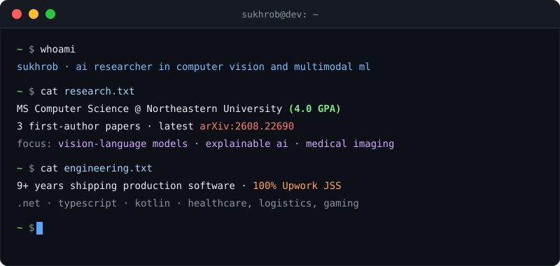
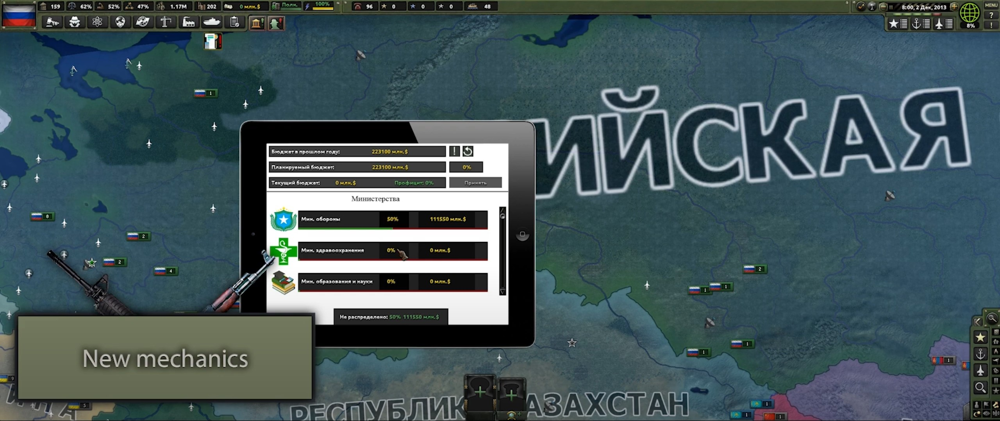
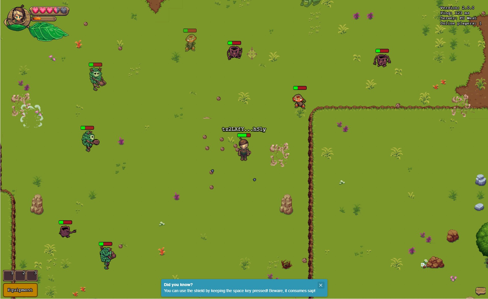

<!-- Animated Header Banner -->

<!-- Terminal-Style Introduction -->

<!-- Badge Row -->

---

## Primary Stack &nbsp;·&nbsp; AI Research

`vision-language models` &nbsp; `contrastive learning` &nbsp; `explainable AI` &nbsp; `medical imaging` &nbsp; `diffusion & inpainting`

 

### Secondary Stack &nbsp;·&nbsp; Software Engineering

Nine years of production work, now mostly in service of shipping research.

 

---

## Research

Three first-author papers in computer vision and multimodal ML.
Full list with abstracts and BibTeX: **[suxrobgm.net/research](https://suxrobgm.net/research)** ·
[Google Scholar](https://scholar.google.com/citations?user=p7ujRHoAAAAJ&hl=en)

### Publications

<table>
<tr>
<td width="33%">

**MorphoCLIP**

Matches Cell Painting microscopy of perturbed cells to descriptions of the treatment in ordinary language. DINOv3 and BioClinical ModernBERT stay frozen and only small projection heads train, so it fits on one consumer GPU. Tested on **CPJUMP1** (51 plates, 3M+ images).

The precomputed DINOv3 embeddings are [on the Hub](https://huggingface.co/datasets/suxrobgm/cpjump1-dinov3-features) as WebDataset shards, so the expensive pass over the images does not have to be repeated.

</td>
<td width="33%">

**Localize, Don't Beautify**

Ask a commercial image editor to change one feature of a face and it beautifies the whole thing. Compares prompt-only steering, masked compositing, and inpainting across **six commercial editors** on 196 edits, scoring identity preservation and whether the edit stayed put. Plain masking localized better.

</td>
<td width="33%">

**MelanomaNet**

Explainable classification across all **9 ISIC 2019 categories** (0.856 weighted F1 on 25,331 images). GradCAM++ attention is broken down along the ABCDE criteria clinicians already use, then scored against those same features, so the interpretability claim rests on a metric.

</td>
</tr>
</table>

### Applied Vision Work

Models built against real inputs rather than a clean benchmark split.

<table>
<tr>
<td width="50%">

**[Med Image Scanner](https://github.com/suxrobgm/med-image-scanner)**

Pulls studies straight from hospital PACS over DICOM and runs detection models over them. Predictions show up as overlays in the viewer, alongside measurement and segmentation tools. HIPAA-ready.

</td>
<td width="50%">

**[Bookshelf Scanner](https://github.com/suxrobgm/bookshelf-scanner)**

Point a camera at a bookshelf and get back a list of what is on it. YOLO segmentation cuts out each spine, then a vision-language model reads the title and author off it.

</td>
</tr>
</table>

### Graduate Coursework

Kept separate from the published work above.

<table>
<tr>
<td width="50%">

**[LightDepth](https://github.com/suxrobgm/lightdepth)**

Lightweight monocular depth estimation. Holds accuracy at **14.3M params** where Depth Anything V2 needs 24.8M, runs **72% faster**, and comes out slightly ahead on relative error on NYU Depth V2.

</td>
<td width="50%">

**[FSRCNN](https://github.com/suxrobgm/fsrcnn)**

Reproduction of FSRCNN (Dong et al., ECCV 2016) for super-resolution at 2x/3x/4x. Upsampling is learned end to end, which is where the **40x speedup** over SRCNN comes from (+1.78 dB PSNR on Set5).

</td>
</tr>
</table>

---

## Software Engineering

<table>
<tr>
<td align="center" width="33%">

 
<strong>60K+</strong>
 
Users on Meat.gg
</td>
<td align="center" width="33%">

 
<strong>10+</strong>
 
Shipped Projects
</td>
<td align="center" width="33%">

 
<strong>100%</strong>
 
Upwork Job Success
</td>
</tr>
</table>

<table>
<tr>
<td width="50%">

**[LogisticsX](https://logisticsx.app)** &nbsp; 

Multi-tenant TMS for intermodal trucking. Wired into the big load boards (DAT, Truckstop), with ELD/HOS compliance, Stripe Connect, route optimization, and live tracking. **DDD + CQRS architecture.**

</td>
<td width="50%">

**[Meat.gg](https://meat.gg)** &nbsp; `60K+ users` `1K+ DAU`

Community platform for Counter-Strike 2 servers. Profiles and messaging, a shop running on Stripe, and a native plugin that lets admins ban, report, and moderate from inside the game.

</td>
</tr>
<tr>
<td width="50%">

**[DepVault](https://depvault.com)** &nbsp; 

Scans a project's dependencies across **8+ ecosystems** for known vulnerabilities via OSV.dev, and doubles as an encrypted secrets vault: AES-256-GCM, one-time secret sharing, CI/CD token injection.

</td>
<td width="50%">

**[Blazor Form Builder](https://github.com/suxrobgm/blazor-form-builder)**

Drag-and-drop form designer that outputs JSON schema with a runtime renderer, so admin dashboards stop needing hand-written forms.

</td>
</tr>
</table>

---

## Games

<table>
<tr>
<td width="50%">

**Hearts of Iron IV: Economic Crisis**
[Steam Workshop](https://steamcommunity.com/sharedfiles/filedetails/?id=2000532465) · [Releases](https://github.com/Economic-Crisis/Public-releases)

Large-scale mod with custom mechanics, AI behaviors, and balance systems.

</td>
<td width="50%">

**Chestnut (MMO)**
[Play](https://www.chest-nut.io)

Real-time MMO with authoritative server, custom physics, and sync for **100+ concurrent players** with Web3 integration.

</td>
</tr>
<tr>
<td width="50%">

**ChessMate**
[Repo](https://github.com/suxrobGM/online-chess)

Online chess platform with AI opponents, rated/friendly PvP matchmaking.

</td>
<td width="50%">

**Maze**
[Repo](https://github.com/suxrobGM/maze-godot)

2D puzzle game with AI pathfinding and level progression.

</td>
</tr>
</table>

---

### GitHub Stats

---

### Let's Connect

Open to research collaborations and PhD-adjacent work. Happy to talk about **computer vision**, **multimodal ML**, and **explainable AI**, or about **.NET**, **TypeScript**, and **game dev**.

<!-- Footer Wave -->

